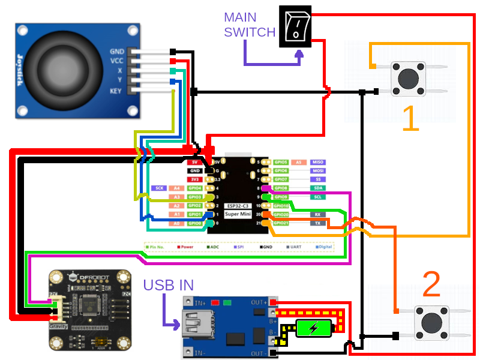
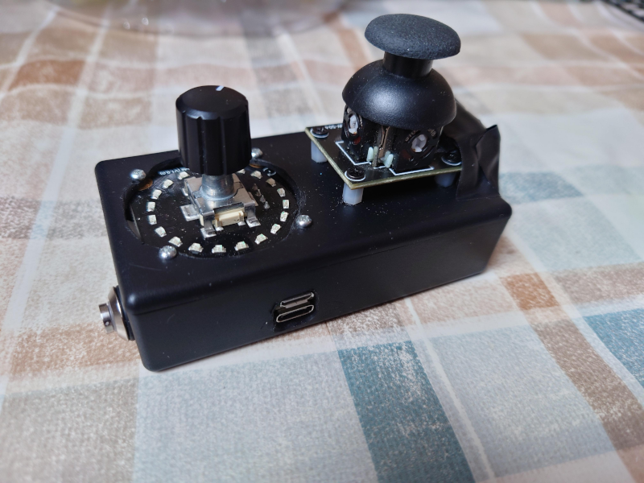
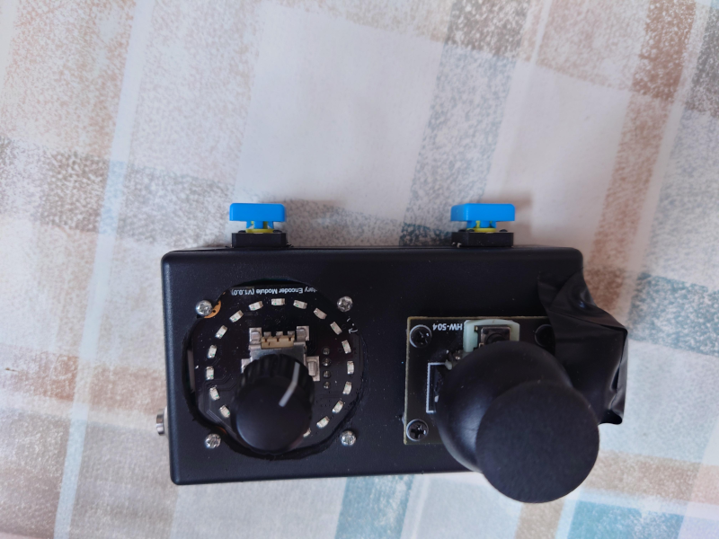
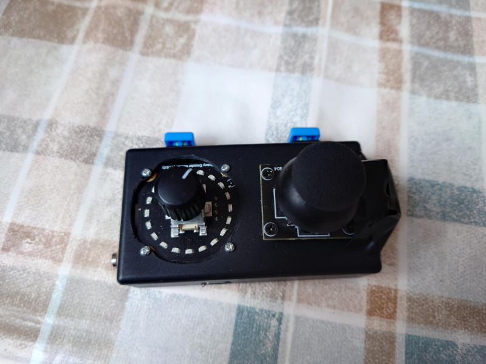

# Kodi-Remote-Pilot
The aim is to create a physical pilot which will be operating Kodi server as custom BT keyboard.

# Why?
I absolutely hate missing the keys on a smartphone when looking at a monitor - no tactical feedback, basically unusable for me, thus I need smth what I can use without looking at it.
So the idea of a custom tiny physical keyboard appeared.

# Hardware
The schematics looks like this (image below):

List of parts needed:
* 1 x [ESP32 C3 Super Mini](https://www.aliexpress.com/w/wholesale-esp32-c3-super-mini.html?spm=a2g0o.home.search.0) (or [similar](https://botland.store/esp32-wifi-and-bt-modules/23869-esp32-c3-zero-mini-development-board-with-soldered-connections-esp32-c3fn4-waveshare-25452.html)).
  > **Important!!!!** Not all ESP32 C3's pinout is the same - please double or even better triple check the pin numbers!
* 2 x [momentary switches](https://botland.store/79-tact-switch)
* 1 x [bistable switch (turn on-off)](https://botland.store/search?s=bistable%20switch)
* 1 x [battery 4.2V](https://botland.store/275-battery-li-pol-1s-37-v)
* Wires (AWG28 will be absolutely [enough](https://www.powerstream.com/Wire_Size.htm). Can be bought for example [here](https://botland.store/single-strand-wires/15203-wire-spool-set-22awg-diferent-collors-75m-x-6pcs-5904422323479.html) *(yes, I know it is a link for AWG22 - every AWG less than 28 should work.)*)
* 1 x USB charging module for the battery (like [this](https://botland.store/charger-modules-for-li-po-batteries/6944-lipol-charger-tp4056-1s-37v-microusb-with-5904422375355.html))
* 1 x Rotary Encoder module (I used [DFRobot SEN0502](https://wiki.dfrobot.com/SKU_SEN0502_Rotary_Encoder_Module_I2C))
* 1 x Arduino-compatible Joystick (I used [Iduino ST1079](https://botland.store/joystick/1942-thumb-joystick-5904422356231.html))

Connect according to schematics and put into some nice plastic box

# Software

* The ["ino" file](kodi_remote.ino) in the repo - use Arduino IDE (I used v. 2.3.2 on Linux for reference).
* [DFRobot_VisualRotaryEncoder Library](https://github.com/DFRobot/DFRobot_VisualRotaryEncoder)
* [BleKeyboard library](https://github.com/oden-umaru/ESP32C3-BLE-Keyboard)
* [NimBLE-Arduino library](https://github.com/h2zero/NimBLE-Arduino)

# Result

